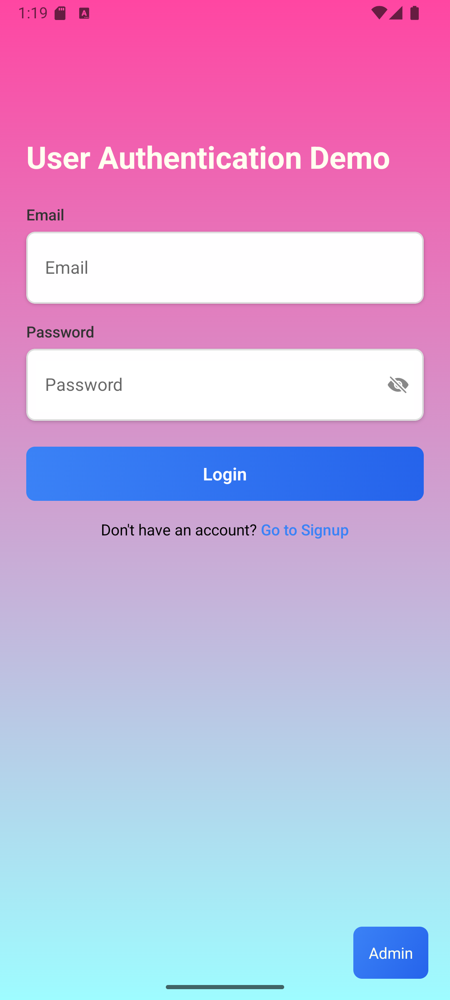
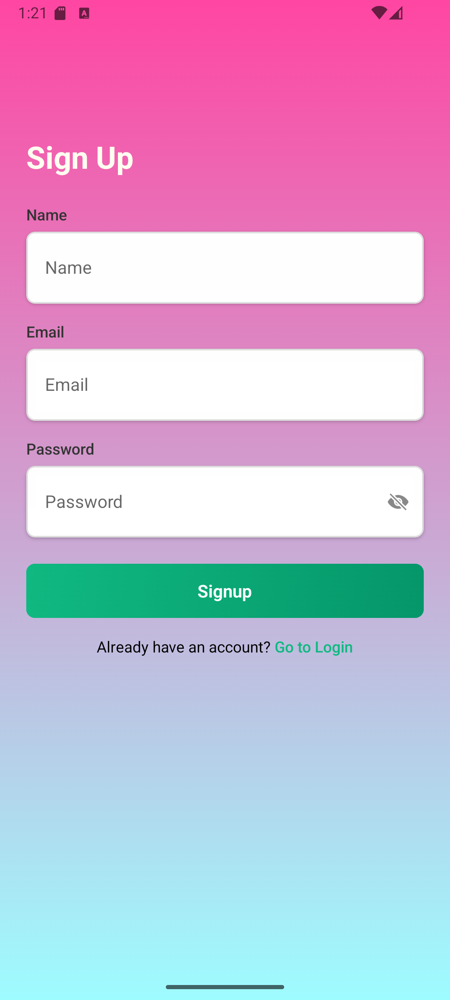
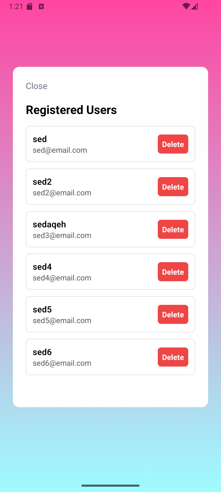

# React Native Authentication App

A simple, modular authentication app built with **React Native (Expo)** and **TypeScript**. It demonstrates key concepts like form handling, navigation, and global state management using the React Context API.

This project is part of a technical assessment and is structured to reflect clean architecture, readable code, and best practices.

---

## 🚀 Features

- 🔐 **Authentication Flow**
  - Login / Signup screens with validation
  - Error handling and feedback
  - Password visibility toggle (eye icon)
- 🧠 **React Context API**
  - Centralized global auth state
  - Handles login, signup, logout
- 💾 **AsyncStorage (JSON Simulated DB)**
  - Persists user session and credentials as JSON objects
  - Stores all registered users under the `users` key
- 🔀 **React Navigation**
  - Seamless navigation between Login, Signup, and Home screens
- 🛠️ **Admin Panel**
  - Hidden "Admin" button on login screen
  - View all registered users (from AsyncStorage)
  - Delete individual users from the local JSON DB
- 🎨 **Polished UI**
  - Clear, responsive layout
  - Reusable `Input` component with consistent styling

---

## 🧠 Tech Stack

| Layer       | Tool/Library                                       |
| ----------- | -------------------------------------------------- |
| UI          | React Native + Expo + TypeScript                   |
| Navigation  | React Navigation (Native Stack)                    |
| State Mgmt  | React Context API                                  |
| Persistence | @react-native-async-storage/async-storage          |
| Components  | `TextInput`, `TouchableOpacity`, `Ionicons` (Expo) |

---

## 🧭 App Screens

1. **Login Screen**
   - Email + Password input
   - Validation for format
   - Navigates to Signup
   - Hidden "Admin" button in bottom-right for testing/viewing users
2. **Signup Screen**
   - Name + Email + Password input
   - Validation for all fields
   - Navigates to Login
3. **Home Screen**
   - Displays user's name and email
   - Logout returns to Login screen
4. **Admin (Users) Screen**
   - List of all registered users
   - Option to delete individual users
   - Returns to login via Close button

---

## 📂 Project Structure

```
AuthApp/
├── App.tsx
└── src/
    ├── context/
    │   └── AuthContext.tsx
    ├── navigation/
    │   └── AppNavigator.tsx
    ├── screens/
    │   ├── LoginScreen.tsx
    │   ├── SignupScreen.tsx
    │   ├── HomeScreen.tsx
    │   └── UsersScreen.tsx
    └── components/
        ├── Input.tsx
        └── ScreenWrapper.tsx
```

---

## ⚙️ Setup Instructions

### 1. Clone the Repository

```bash
git clone https://github.com/SedAqeh/UserAuthenticationApp_SyedFaqihHassan.git
cd auth-app
```

### 2. Install Dependencies

```bash
npm install
```

### 3. Start the App

```bash
npx expo start
```

This will open a local development server with a QR code.

---

## 📱 Running on Device/Emulator

- 📱 **Expo Go App (Recommended):**

  - Install Expo Go from Play Store / App Store
  - Scan the QR code from terminal or browser

- 📱 **Android Emulator:**

  ```bash
  npx expo start --android
  ```

- 🍏 **iOS Simulator (Mac only):**
  ```bash
  npx expo start --ios
  ```

---

## 🧪 Features Breakdown

| Feature           | Description                                              |
| ----------------- | -------------------------------------------------------- |
| `AuthContext`     | Manages user state and exposes login/signup/logout       |
| `AsyncStorage`    | Persists auth state across sessions                      |
| `AppNavigator`    | Conditionally renders stack based on login state         |
| `Input.tsx`       | Reusable styled input with optional password toggle      |
| `ScreenWrapper`   | Shared layout container with gradient + keyboard dismiss |
| Admin Panel       | Lists users, allows deletion from JSON store             |
| Form Validation   | Checks for email format, empty fields, min password      |
| Navigation        | React Navigation handles screen transitions              |
| JSON Simulated DB | User data saved as JSON under AsyncStorage's `users` key |

---

## 🧠 How Signup Logic Works (AsyncStorage-backed)

1. On signup, the app:

   - Loads existing users from AsyncStorage using the `users` key
   - Validates if the new email is unique
   - If valid, appends the new user (name, email, password) to the list
   - Saves the updated array back to AsyncStorage as a JSON string
   - Stores the current session in another key `currentUser`

2. On login:

   - The app loads the `users` array
   - It checks if the provided email and password match any user
   - If match found, stores that user's info in `currentUser`

3. On app launch:
   - The app attempts to load `currentUser` to restore the session

> This simulates a local database using JSON without requiring a real backend.

---

## 📸 Screenshots

> Replace these with your own Expo screenshots for submission.

| Login                      | Signup                      | Home                      | Admin                      |
| -------------------------- | --------------------------- | ------------------------- | -------------------------- |
|  |  |  |  |

---

## 📄 Submission Checklist

✅ Code pushed to GitHub  
✅ Includes `README.md`  
✅ Screenshots or screen recording  
✅ Login/Signup/Home/Admin flow working  
✅ AsyncStorage simulates JSON user DB and persists login

---

## 📝 License

This project is for educational/demo purposes as part of a technical test.  
Feel free to fork and customize it.
